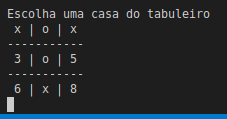

.. Velha3D documentation master file, created by
   sphinx-quickstart on Mon Nov 30 15:30:56 2020.
   You can adapt this file completely to your liking, but it should at least
   contain the root `toctree` directive.

Usando Uma Classe
=================

Agora vamos empacotar tudo dentro de uma classe. A classe representa a ideia concreta
do que se quer construir.

.. note::
  Além das classes já definidas na linguagem e bibliotecas do Python, a diretiva **class**
  permite que criemos a nossa própria classe.
    

Criando uma classe
-------------------

Vamos criar uma classe **Velha** para encapsular o código.

.. code:: python

    class Velha():
        """Representa o jogo da velha.
        
        Referências:
        
        casa
        Lista contendo as casas do jogo.
        
        jogador
        Marcador do jogador com a vez corrente.
        """
        ESCOLHA = "Escolha uma casa do tabuleiro"
        """Frase para pedir uma jogada."""
        FINAL = "Situação final do tabuleiro"
        """Frase indicando o fim o do jogo."""
        TABULEIRO = """
            {}
            {} | {} | {}
            -----------
            {} | {} | {}
            -----------
            {} | {} | {}
            """   
        """Display mostrando a situação atual do tabuleiro."""

.. note::
  colocamos todas as nossa constantes dentro do espaço de nomes da classe. Isto significa
  que estas constantes estão circunscritas à classe e não estão disponíveis no espaço global.
  Para ter acesso a elas precisamos referenciar primeiro o nome da classe, adicionar um ponto
  e depois por o nome da variável.

Inicializador de Classe
-----------------------

O método **__init__ ()** é uma convenção da linguagem Python. Ele é invocado assim que
a instância de classe é criada. No código é usado para criar as estruturas iniciais do
objeto construído. No nosso caso, criamos uma lista de casas e um jogador. A partícula
**self** indica que uma referência é um atributo do objeto e pode ser referenciado em
outros métodos.

.. code:: python

    def __init__(self):
        self.casa = [None]*9
        """A operação de multiplicar com a lista contendo um **None**
        gera uma lista contendo nove posições contendo None.
        """

        self.jogador = "x"
        """O jogador com a peça x começa"""

O Comportamento do Objeto
-------------------------

Os otros métodos servem para se definir o comportamento próprio do objeto.
O método **joga ()** define como a classe Velha implementa o comportamento
de jogar. Note que no método se referencia os atributos **self.casa** e 
**self.jogador** que foram definidos no *__init__*. Também são referenciadas
as constantes **Velha.ESCOLHA**, **Velha.FINAL** e **Velha.TABULEIRO**.

.. code:: python

         
    def joga(self):
        """Executa o joga da velha.
        
        Referências:
        
        jogada
        Índice da casa a ser preenchida.
        
        display_das_casas
        Apresentação do conteúdo de cada casa: o índice se vazia ou marcador se cheia.
        """

        while True:
            display_das_casas = [a_casa or posicao for posicao, a_casa in enumerate(self.casa)]

            if all(self.casa):
                print(Velha.TABULEIRO.format(Velha.FINAL, *display_das_casas))
                """Mostra a situação final do tabuleiro."""
                break
            jogada = str(input(Velha.TABULEIRO.format(Velha.ESCOLHA, *display_das_casas)))
            """Mostra a situação atual do tabuleiro e pede a próxima jogada."""
            casa_escolhida = self.casa[int(jogada)]
            """Obtem a peça que está colocada na casa escolhida"""
            if casa_escolhida:
                """Se a casa escolhida já está ocupada volta a fazer a pergunta."""
                continue
            self.casa[int(jogada)] = self.jogador
            """ Coloca a peça na posição pedida pela jogada."""
            self.jogador = "o" if self.jogador == "x" else "x"
            """Troca a vez para o outro jogador."""

Quando o módulo classe é invocado como um programa principal, se constrói
uma instância da classe **Velha** e se invoca o comportammento **joga ()**
nela.

.. code:: python

    if __name__ == '__main__':
        Velha().joga()

Tela Gerada pela Classe
-----------------------

